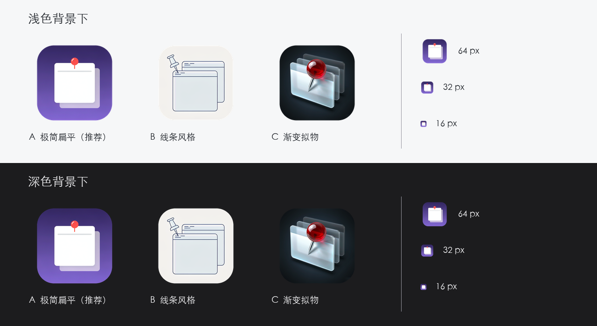

<p align="center">
  
</p>

<h1 align="center">winpin</h1>

<p align="center">macOS 菜单栏窗口置顶工具 —— 按一下 <code>⌃⌥P</code>，任意窗口钉在最上层</p>

<p align="center">
  <a href="https://github.com/ibicf771/winpin/releases/latest"></a>
  
  
  <a href="LICENSE"></a>
</p>

---

## 这是什么

winpin 是一个常驻菜单栏的小工具。开会看参考文档、边写代码边对照设计稿、看视频时腾出窗口——把需要的那个窗口「钉」在最上层，不用再来回切窗口。

- 一个快捷键置顶 / 取消置顶，不用记复杂操作
- 置顶后是一个可拖动的**悬浮镜像窗**，能跨桌面 Space、能浮在全屏应用之上
- 支持 50%~200% 缩放、50%~100% 透明度、多窗口同时置顶
- 开源、免费、无广告、不联网

## 下载安装

### 方式一：GitHub Releases（推荐）

👉 **[下载最新版 DMG](https://github.com/ibicf771/winpin/releases/latest)** → 打开 DMG → 把 `winpin.app` 拖进「应用程序」

### 方式二：国内直连下载（码云 Gitee，不用翻墙）

👉 **[Gitee 镜像仓库](https://gitee.com/ibicf771/winpin)** → 右侧「发行版」→ v1.4.3

或者直接下载 DMG：**https://gitee.com/ibicf771/winpin/releases/download/v1.4.3/winpin-1.4.3-arm64.dmg**

> 蓝奏云直链：**待补充**（备案后可以再加一条不限速通道）

### ⚠️ 第一次打开被系统拦截？

本 App 未购买苹果开发者证书做公证（$99/年），所以 macOS 会提示"无法验证开发者"。**这不是病毒警告，是所有未签名 Mac 软件的通用提示**，三步就能打开：

1. 打开「应用程序」文件夹，**按住 Control 键点击 winpin 图标**（或直接右键）→ 选择 **「打开」**
2. 弹窗里再点一次 **「打开」** 按钮（注意：不能用双击，双击不出现这个选项）
3. 之后就能正常用了，只需操作这一次

如果还是被拦截，也可以在「系统设置 → 隐私与安全性」页面底部找到 winpin 的提示，点「仍要打开」。

或者用终端一步搞定：

```bash
xattr -d com.apple.quarantine /Applications/winpin.app
```

### 授权（首次启动会引导）

| 权限 | 是否必需 | 用途 |
|------|---------|------|
| **屏幕录制** | ✅ 必需 | 建立窗口镜像，否则置顶无画面 |
| **辅助功能** | 可选 | 点击镜像时精准跳回源窗口；「取消置顶时移动窗口」功能 |

在「系统设置 → 隐私与安全性」中勾选 winpin 即可。**更新 App 版本后授权可能失效**——打开 winpin，在首启引导页或「设置 → 权限」中点击 **「重置权限并重启 winpin」** 按钮，重启后重新授权即可（无需手动敲命令）。

## 使用方法

点击菜单栏的图钉图标打开面板：

- 面板列出「已置顶」和「全部窗口」，每行点击即可置顶 / 取消
- 顶部搜索框可按 App 名或窗口标题过滤（窗口多了很好用）
- 快捷键（可在设置页自定义）：

| 快捷键 | 功能 |
|--------|------|
| `⌃⌥P` | 置顶 / 取消置顶当前前台窗口 |
| `⌃⌥⇧P` | 取消所有置顶 |

### 悬浮镜像窗的手势

| 操作 | 效果 |
|------|------|
| **按住拖动** | 把悬浮窗移到任意位置 |
| **单击** | 跳回原窗口（激活源 App 并聚焦），编辑请在原窗口进行 |
| **双击** | 取消置顶（等同于点右上角 ✕） |
| **右键** | 打开菜单：镜像缩放（50%/75%/100%/150%/200%）、透明度滑杆（50%~100%）、取消置顶 |

### 设置项

- **开机自启动**：登录时自动运行
- **快捷键自定义**：改成你习惯的组合键
- **取消置顶时，将窗口移到镜像最后的位置**（默认关闭）：把镜像拖到别处再取消置顶，源窗口会自动移动到该位置——适合「换个地方继续看这个窗口」的场景，需要辅助功能权限
- **权限状态查看与一键重置**

## 常见问题

**Q：置顶后能在悬浮窗里直接打字编辑吗？**
不能。悬浮窗是实时画面镜像，不是在原窗口上操作。**单击镜像**即可跳回原窗口编辑，编辑内容会实时反映到镜像里。这是同类工具的通行做法（事件转发不可靠）。

**Q：为什么置顶的是"镜像"而不是窗口本身？**
macOS 从 26 版起已把第三方真置顶（改窗口层级）的私有接口"中性化"了：调用会返回成功，但系统合成器不执行。winpin 因此改用 ScreenCaptureKit 实时捕获 + 高层级浮窗渲染，效果是——**可以跨 Space、可以浮在全屏应用之上**，体验反而比传统置顶更好。详见[技术实现](#技术实现)。

**Q：需要联网吗？会收集数据吗？**
不需要、不收集。App 完全离线运行。

**Q：支持 Intel Mac 吗？**
目前只提供 Apple Silicon（M 系列）版本。Intel 机器可以自行从源码编译（见下文）。

**Q：全屏应用、多显示器、台前调度下正常吗？**
基本可用，个别系统版本下行为以实测为准。

## 系统要求

- macOS 14.0 或更高（开发验证环境：macOS 26.3 Tahoe / M2）
- Apple Silicon（arm64）

## 从源码构建

```bash
scripts/build_release.sh   # 产出 build/Release/winpin.app（xcodebuild 主路径，swift build 兜底）
scripts/make_dmg.sh        # 产出 build/winpin-1.4.3-arm64.dmg（版本号自动读取 Info.plist）
cd tests && swift test --disable-sandbox --enable-xctest   # 运行单元测试（32 项）
```

发布（自动同步 GitHub + 码云两端 Release 与 DMG）：

```bash
scripts/publish.sh              # 用现有 DMG 发布
scripts/publish.sh --build      # 先构建再发布
scripts/publish.sh --dry-run    # 只打印将要执行的命令
```

- 技术栈：SwiftUI + AppKit，**零第三方依赖**
- 工程为手写 `xcodeproj`（不依赖 SwiftPM 解析带来的网络与缓存问题）

### 项目结构

```
winpin/
├── App/            # 应用入口、AppDelegate、菜单栏面板
├── Core/           # 置顶引擎（MirrorPinningEngine 镜像方案 / SkyLightPinningEngine 保留）
├── Services/       # 权限、快捷键、登录项、设置存储
├── UI/             # 面板与设置界面
├── Utilities/      # AXHelper（辅助功能桥接）、日志等
└── tests/          # SwiftPM 测试包（32 个 XCTest）
```

## 技术实现

**镜像置顶方案（v1.1 起为默认）**

对目标窗口建立 ScreenCaptureKit 实时流（`SCContentFilter desktopIndependentWindow`，20fps），渲染到自有高层级浮窗：

```swift
NSPanel(styleMask: [.borderless, .nonactivatingPanel])
panel.level = .floating
panel.collectionBehavior = [.canJoinAllSpaces, .fullScreenAuxiliary]
```

watchdog 每 1.5 秒巡检几何信息跟随源窗口移动 / 缩放，源窗口销毁时自动清理。

**保留但不启用的真置顶引擎**

`SkyLightPinningEngine` 通过 `dlopen` + `dlsym` 桥接 SkyLight 私有 API（`SLSMainConnectionID` / `SLSGetWindowLevel` / `SLSSetWindowLevel`）。在 macOS 26.3 实测：调用返回成功、读回值也变为 3，但 `CGWindowList` 显示窗口 `layer` 仍为 0，合成器不执行跨进程设级——因此不再默认启用，代码保留以备系统行为变化。

**其他**

- 菜单栏常驻：`LSUIElement = true`（无 Dock 图标），`NSStatusItem` + `NSPopover`
- 全局快捷键：Carbon `RegisterEventHotKey`（无需辅助功能权限即可响应）
- 开机自启：`SMAppService` 登录项
- 窗口操作：`_AXUIElementGetWindow`（dlsym）+ `kAXPositionAttribute`

## 已知限制

- 镜像是实时画面而非原窗口本体，**无法在镜像内直接输入 / 编辑**（见 FAQ）
- 源窗口移动 / 缩放时镜像会跟随回源窗口位置
- 全屏 Space、台前调度、多显示器下的表现以实测为准
- 不做重启后恢复置顶（设计决策）

## 反馈与贡献

- 遇到问题或有功能建议：欢迎提 [Issue](https://github.com/ibicf771/winpin/issues)
- 代码贡献：欢迎 PR

## 许可

[MIT License](LICENSE) © 2026 ibicf771
